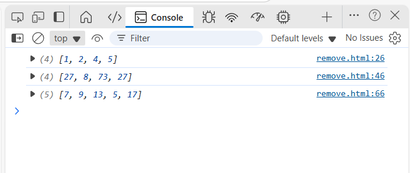

# Challenge 4 : Remove Middle Value

### We need to write a function called RemoveMiddleValue that takes in an array as its parameter. The function should remove the value at the middle index of the array. The function should then return the modified array.

#### And there is the consle.log output :

