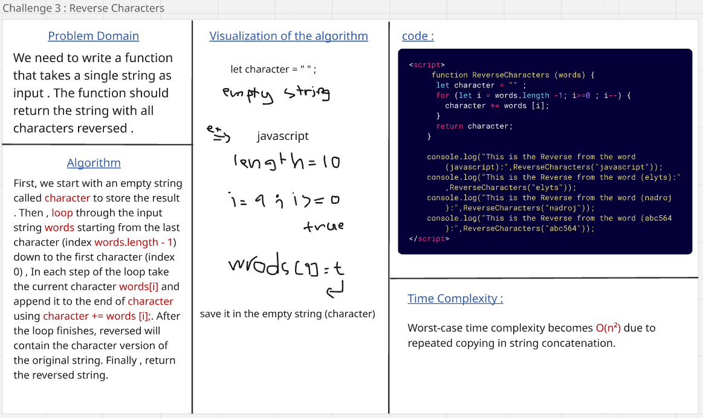
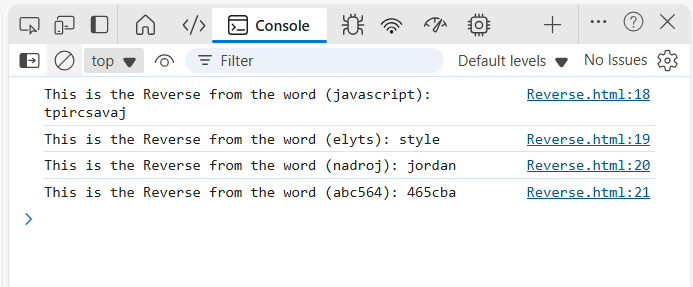

### Challenge 3 : Reverse Characters

#### In this case we need to write a function that takes a single string as input . The function should return the string with all characters reversed .

#### And this the consle.log output :

