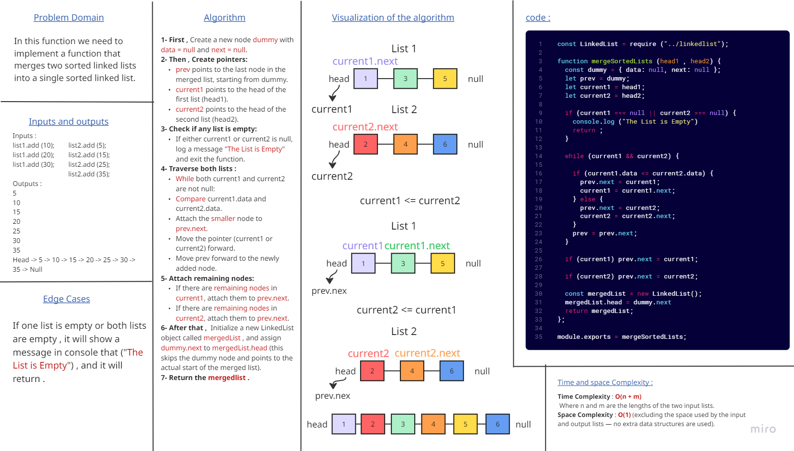
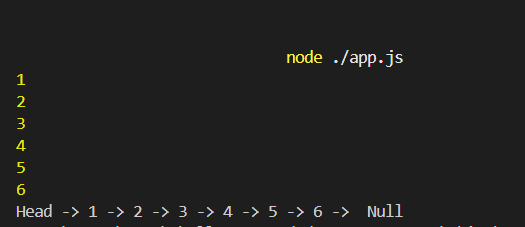

# Linked List Merge Sorted Lists

### This challenge is to implement a function that merges two sorted linked lists into a single sorted linked list.

### and this is the output that shown in console :

