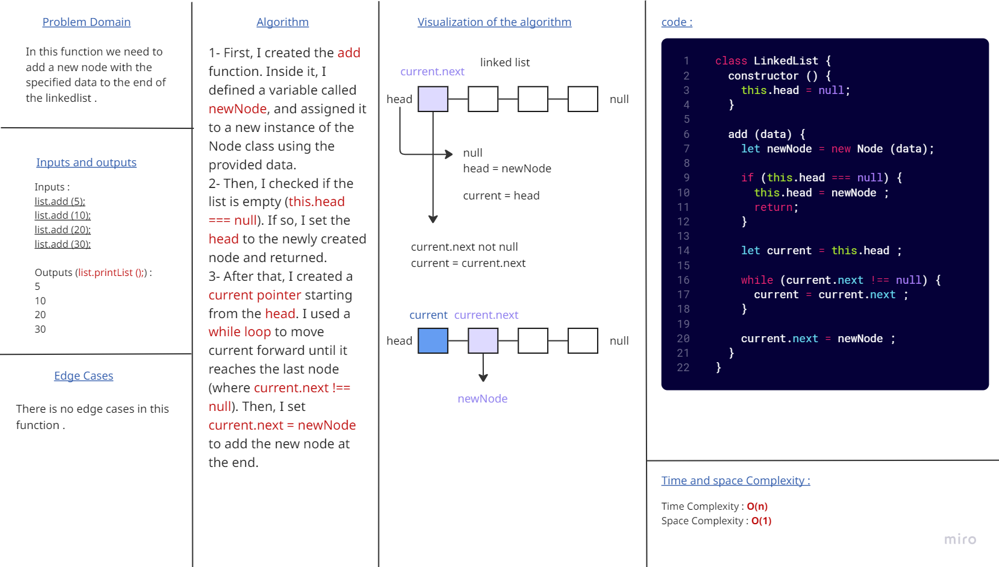
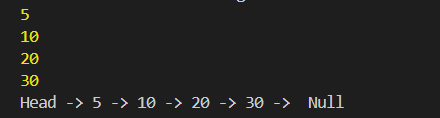
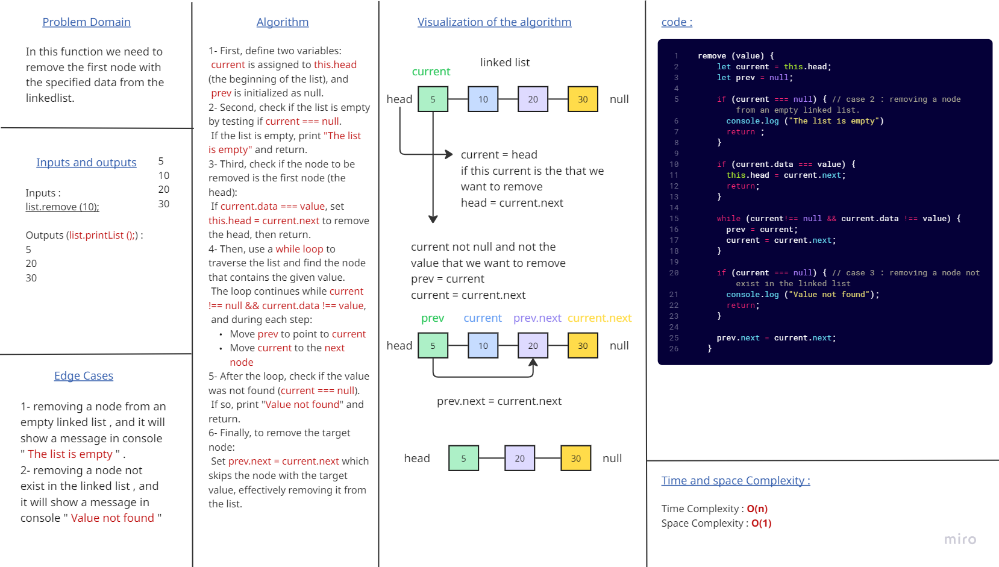
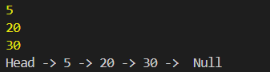
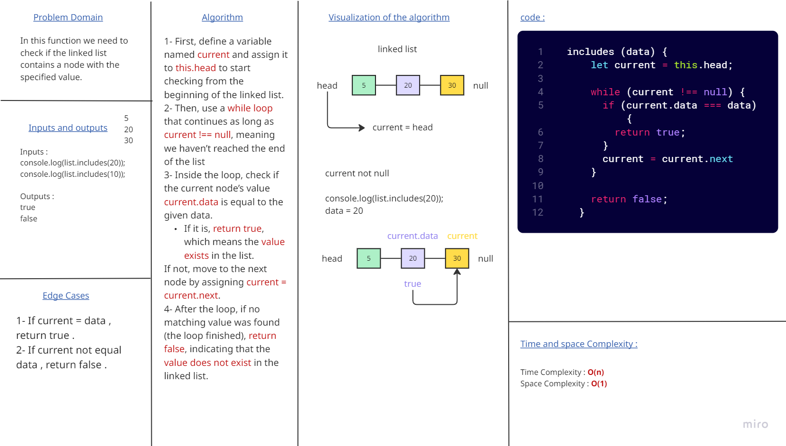
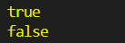
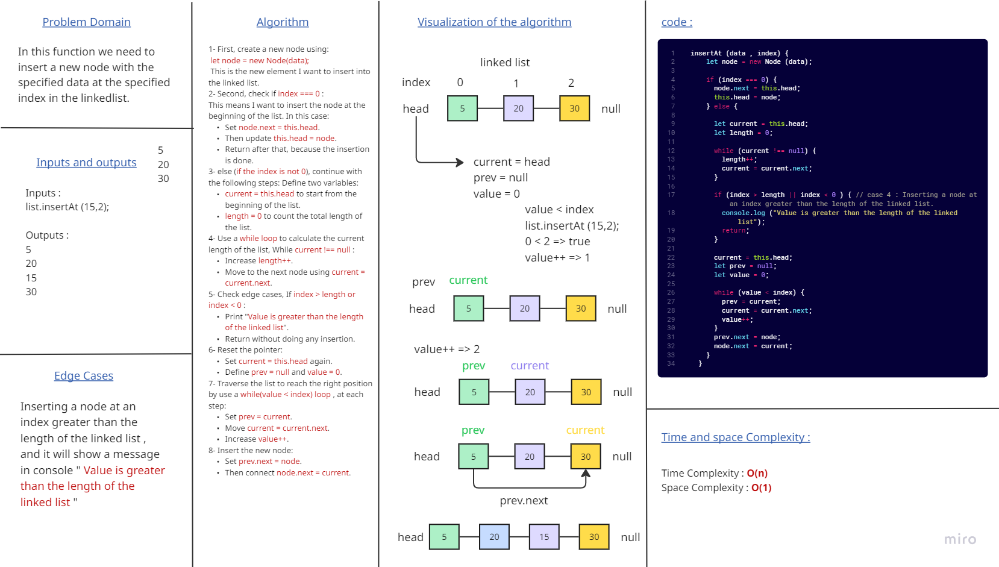
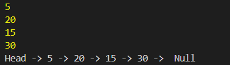

# Linked List Implementation 

### This challenge is a console-based solution by implement a singly linked list data structure in javascript.

## The Linked List class support functions to :

### add(data) : Add a new node with the specified data to the end of the linkedlist.

### and this the output that shown in console :

### remove(data) : Remove the first node with the specified data from the linkedlist.

### and this the output that shown in console :

### includes(data) : Check if the linked list contains a node with the specified value.

### and this the output that shown in console :

### insertAt(data, index) : Insert a new node with the specified data at the specified index in the linkedlist.

### and this the output that shown in console :

