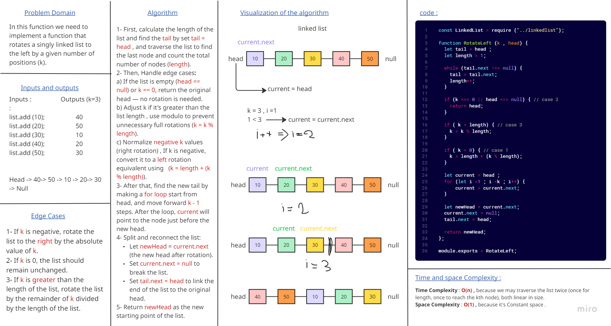
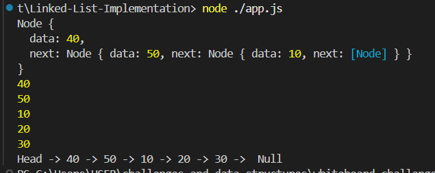

# Linked List Rotate by K 

### This challenge is to implement a function that rotates a singly linked list to the left by a given number of positions (k).

### and this is the output that shown in console :

