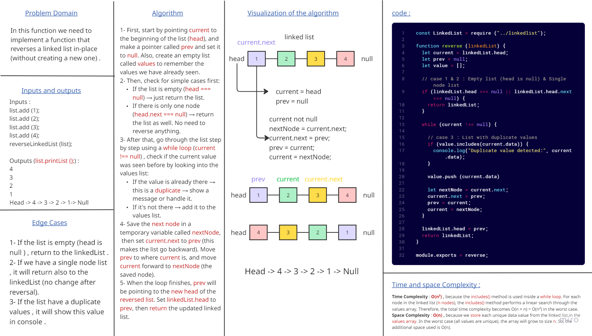
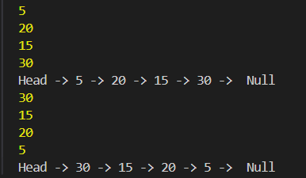

# Linked List Reverse 

### This challenge is to implement a reverse() function for a singly linked list, reversing its nodes in-place without creating a new list. 

### and this is the output that shown in console :

