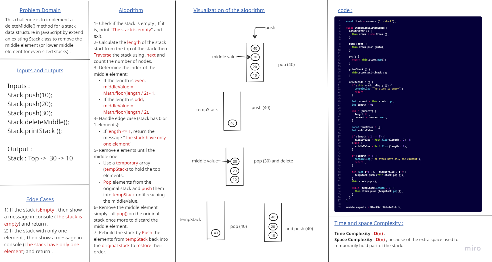
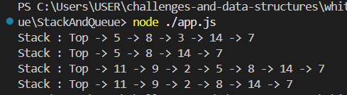

# Delete Middle Element of a Stack

### This challenge is to implement a deleteMiddle() method for a stack data structure in JavaScript by extend an existing Stack class to remove the middle element (or lower middle element for even-sized stacks), handling edge cases and maintaining correct stack order.

## Delete Middle Whiteboard :

### and this is the output that shown in console :

