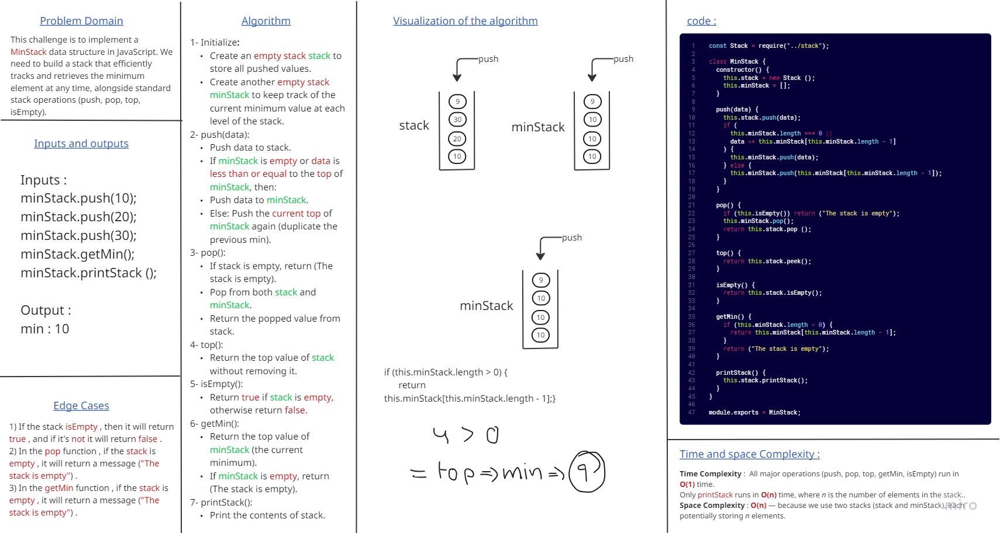
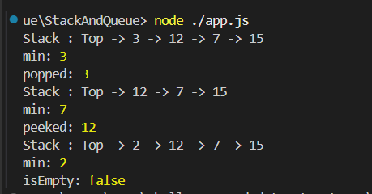

# Min-Stack Challenge

### This challenge is to implement a MinStack data structure in JavaScript. I build a stack that efficiently tracks and retrieves the minimum element at any time, alongside standard stack operations (push, pop, top, isEmpty).

## Min-Stack Whiteboard :

### and this is the output that shown in console :

