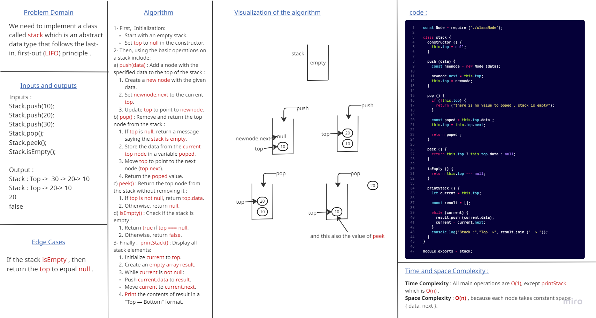
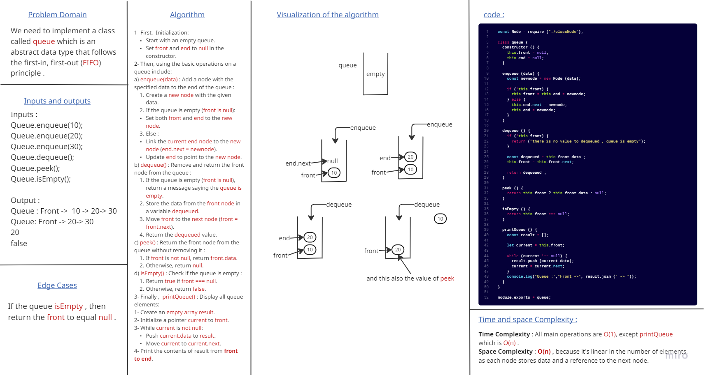
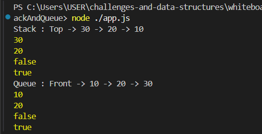

# Stack and Queue Implementation

### This challenge is to implement Stack and Queue data structures in JavaScript, complete with Jest unit tests by using the fundamental data structure concepts, focusing on their core methods (push/pop/peek/isEmpty for Stack, enqueue/dequeue/peek/isEmpty for Queue).

## Stack Whiteboard :

## Queue Whiteboard :

### and this is the output that shown in console :

