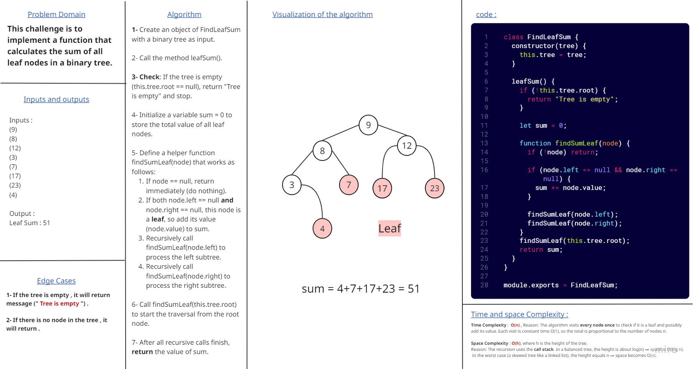
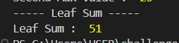

# Binary Tree - Sum of leaf nodes

## This challenge is to implement a function that calculates the sum of all leaf nodes in a binary tree.

## Leaf Sum Whiteboard :

### and this the output that shown in console :

