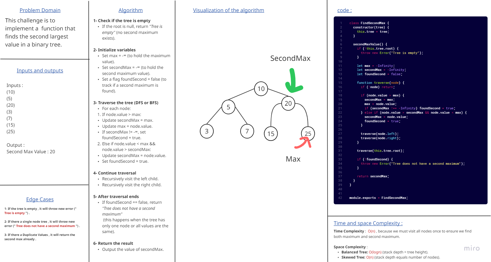
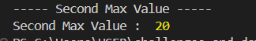

# Binary Tree - Second Maximum Value

## This challenge is to implement a function that finds the second largest value in a binary tree.

## Second Maximum Value Whiteboard :

### and this the output that shown in console :

